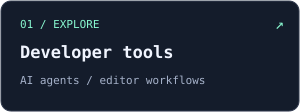
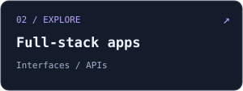
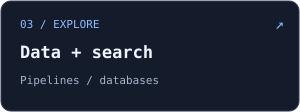

<a name="top"></a>

[](#about)

<p align="center">
  <a href="#about"><code>about.ts</code></a> &nbsp; / &nbsp;
  <a href="#latest"><code>latest.log</code></a> &nbsp; / &nbsp;
  <a href="#stack"><code>stack/</code></a> &nbsp; / &nbsp;
  <a href="#bonus"><code>side-quest/</code></a> &nbsp; / &nbsp;
  <a href="#contact"><code>say-hi</code></a>
</p>

<a name="about"></a>

### 👋 hey, I'm Jeff

Computer Engineering @ **University of Waterloo** · Class of 2028

```ts
const jeff = {
  builds: ["AI developer tools", "full-stack apps", "data & search systems"],
  languages: ["TypeScript", "Python", "C++", "SQL"],
  latestInternship: "CogniChip",
};
```

<a href="#tools"></a>
<a href="#apps"></a>
<a href="#data"></a>

<a name="latest"></a>

### 🧠 Most recently

**Software Engineering Intern @ CogniChip** · Jan–Apr 2026

Worked on an AI-powered chip design IDE: integrating agents into the editor,
building code analysis and debugging workflows, and helping developers review
AI-generated changes. Also worked on Redux debugging tools and AI-driven UI testing.

> *Yes, debugging the debugger was part of the job.*

<a name="stack"></a>

### 🛠️ My corner of the stack

[](https://skillicons.dev)

**Pick a folder to explore ↓**

<a name="tools"></a>
<details>
<summary><b>📂 tools-for-developers/</b> — AI agents, VS Code extensions, debugging workflows</summary>

Tools that help people write, understand, and debug code.

`VS Code API` · `React` · `Redux` · `Playwright`

At CogniChip, that meant bringing agents into the editor, connecting code context
to debugging tools, and giving developers control over AI-generated edits.

</details>

<a name="apps"></a>
<details>
<summary><b>📂 things-people-use/</b> — React interfaces, APIs, full-stack web apps</summary>

The interface, the API, and the plumbing between them.

`TypeScript` · `React` · `Node.js` · `Express` · `MongoDB`

I've worked on dashboards, authentication, real-time permissions,
and tools for editing and finding media.

</details>

<a name="data"></a>
<details>
<summary><b>📂 things-under-the-hood/</b> — geospatial pipelines, databases, video search</summary>

Making large collections of data easier to process and search.

`Python` · `PostgreSQL` · `PostGIS` · `GeoPandas` · `Elasticsearch`

My work has included geospatial ETL, map annotation tools, query optimization,
and search across video metadata.

</details>

<a name="bonus"></a>

### 🎮 A tiny side quest

<details>
<summary><b>🐛 Find the bug</b> — a 10-second JavaScript detour</summary>

Three jobs. Shortest first. Easy, right?

```js
const jobDurations = [3, 20, 1];
jobDurations.sort();

// expected: [1, 3, 20]
// actual:   ?
```

<details>
<summary>🔎 Reveal the answer</summary>

**`[1, 20, 3]`**. JavaScript's default sort compares string representations.

```js
jobDurations.sort((a, b) => a - b);
// [1, 3, 20]
```

*Bug fixed. You may now return to your regularly scheduled debugging.*

</details>
</details>

<a name="contact"></a>

### 👋 Say hi

[LinkedIn](https://www.linkedin.com/in/jeffcao8/) · [Email](mailto:jeff.cao@uwaterloo.ca)

<p align="right"><a href="#top"><code>↑ back to top</code></a></p>
